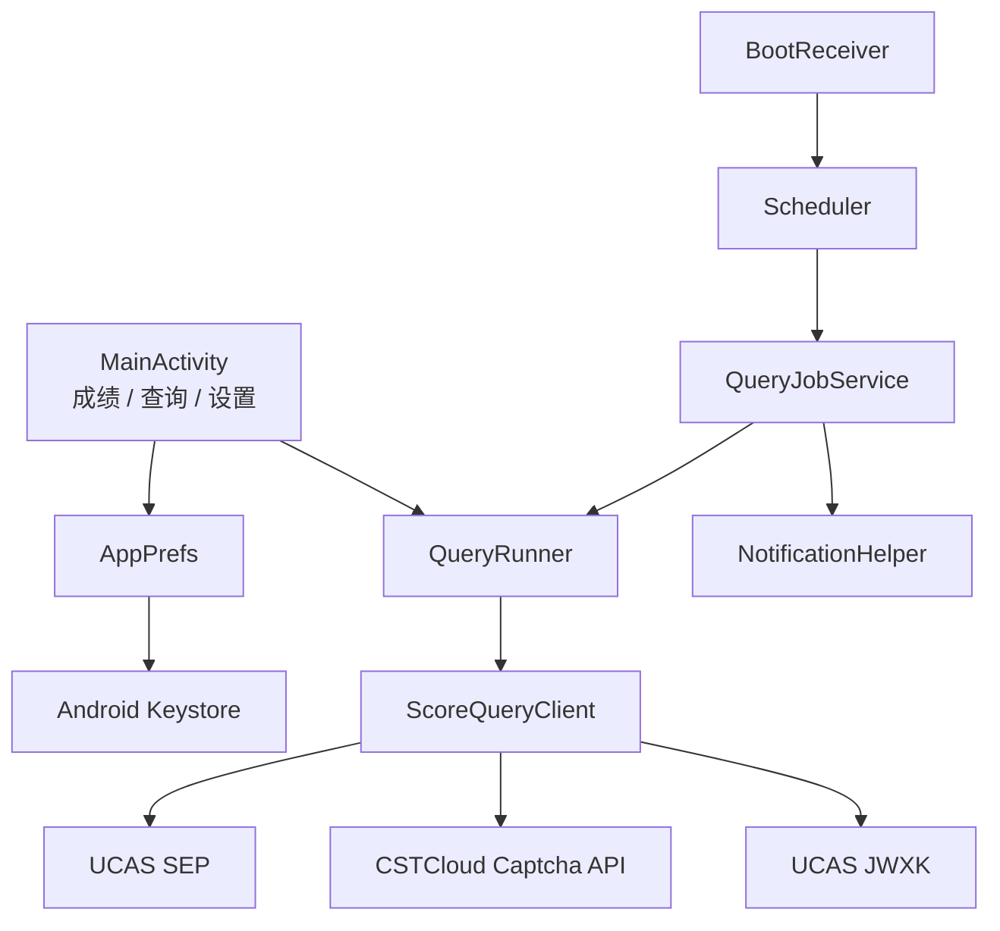

# 架构说明

## 总体结构

## 模块

- `MainActivity`：使用原生 Android View 动态构建三个页面，不依赖第三方 UI 框架；
- `ScoreQueryClient`：维护同一 `CookieManager`，完成 SEP 登录、JWXK Identity 跳转和成绩解析；
- `QueryRunner`：对完整查询创建全新 Session，并按错误类型执行退避重试；
- `QueryJobService`：由系统周期任务触发，保存自动查询记录并发送通知；
- `Scheduler`：基于 `JobScheduler` 配置网络约束、周期和指数退避；
- `AppPrefs`：保存设置、成绩基线和最近查询记录；
- `SecureStore`：使用 Android Keystore AES/GCM 加密敏感设置。

## 设计约束

- 最低 Android 8.0（API 26）；
- 后台周期任务不保证精确到分钟；
- 不在仓库、APK 或日志中写入真实凭据；
- 不在后台绕过 Android 系统的电量和网络调度限制；
- 教务页面变化时优先更新解析器和离线夹具。
